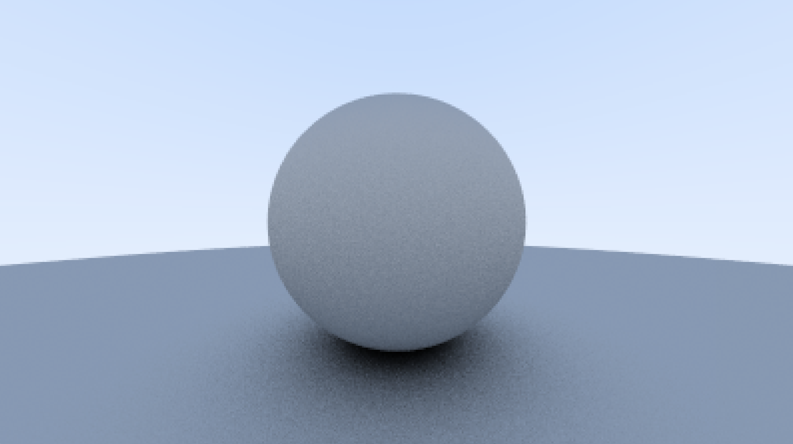

# EECS 334 Report

## Output: PPM

PPM means Portable Pixmap Format. The file will always starts with P3 and this means that the colors are in ASCII, then the number of columns and number of rows. Then the bottom `255` means that this is the max color. Then what follows is the RGB triplets. 

Here is a small example. This is just the first color and the metadata of the file.

```
P3
256 256
255
18 255 63
```

The next thing we have set up is the 3D vector class. The vector has an $x$, $y$, and $z$ component. We add some basic components to it like adding a vector to another vector, scalar multiplication, and division.

With this vector class we are able to perform 3D calculations. 

Now our next focus is the ray class. With all rayt tracerse they have a ray and a compuration of what color is seen along a ray. Here we have the ray as a function 

$$\textbf{P}(t) = \textbf{A}+t\textbf{b}$$

where $\textbf{A}$ is the origin, $\textbf{b}$ is the ray's direction, and $t\in \mathbb{R}$. Inserting a different $t$ and $P(t)$ moves the point along the ray. Negative $t$ can go anywhere on the 3D line; for positive $t$, you only get parts in front of $A$, and this is what is called a half-line ray.

## Sending Rays Into the Scene

A ray tracer send rays throygh pixels and computes the color seen in the direction of those rays. The steps are:

1) Calculate the ray from the eye of the pixel.
2) Determine which objects the ray intersect.
3) Compute a color for that intersection point.

We also need a virutal view port to pas the scene rays. The viewport's aspect ratio should be the same as the rendered image. We will also set the distance between the project plane and the projection point to be one unit. This is focal length!

The eye of the camera will be at the origin $(0, 0, 0)$. Y-axis goes up, and x-axis goes to the right, and into the screen is the negative z-axis.



This is the first sphere rendered that is mat.